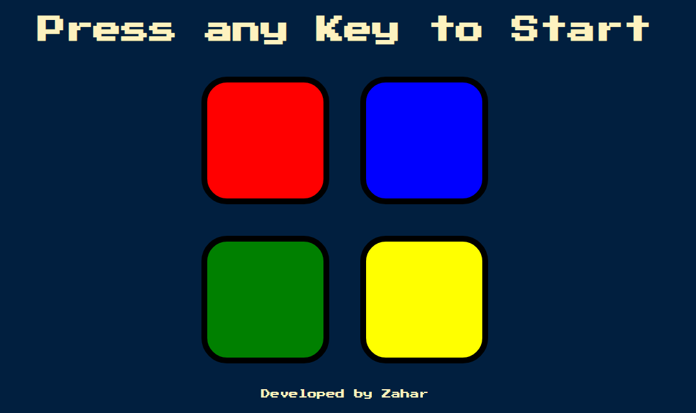

<h3>Visit the Site</h3> https://zaharsm.github.io/simon/   

<h3>Information </h3> this is developed using advanced Advanced JavaScript + JQuery + DOM

<h3>Features </h3> This is game where you have to follow previous action backend Math.random is used with JQuery 

<h3>Tech Stack </h3>  

1) Advanced Javscript 2) DOM 3) AddEventListner 4) OnClickEvent 5)JQuery

  

